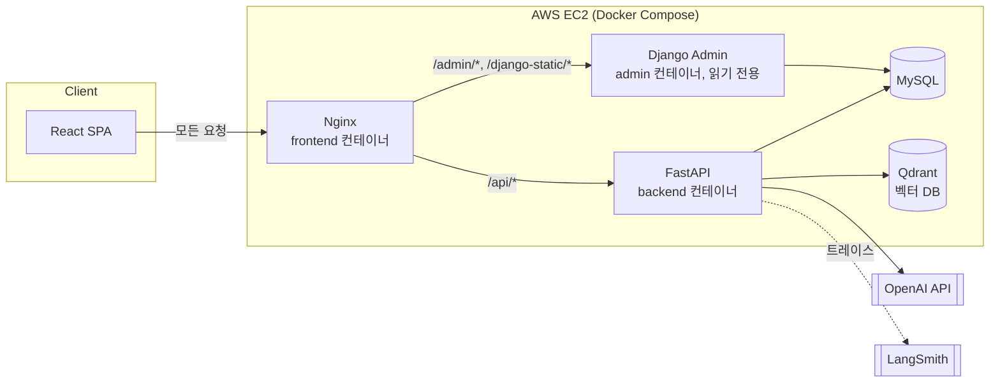
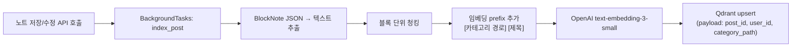
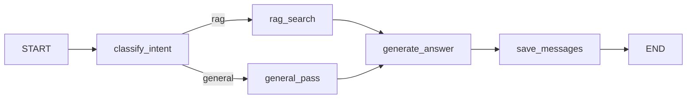
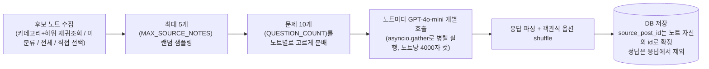
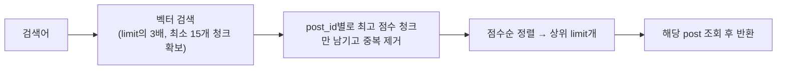
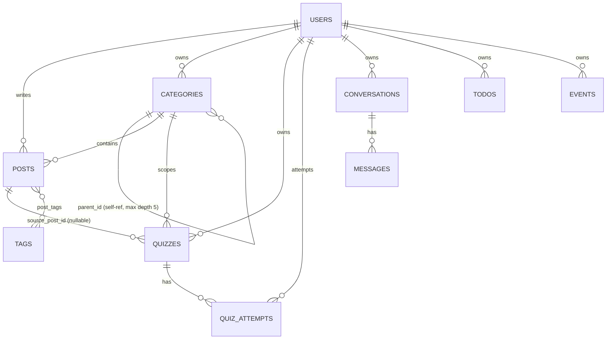

# ARCHITECTURE

StudyLog-AI의 시스템 구조, 핵심 파이프라인(RAG/멀티턴 대화/퀴즈 생성), 데이터베이스 스키마를 정리한 문서입니다. 개발 진행 순서대로 적힌 `PLAN.md` 시리즈와 달리, 지금 시점의 구조를 주제별로 재구성했습니다. 각 결정의 배경/트러블슈팅은 루트의 `README.md` 및 `PLAN.md` ~ `PLAN5.md`, `AI_IMPLEMENTATION_NOTES.md`에 더 자세히 남아있습니다.

## 1. 전체 시스템 구조

- 프런트엔드는 항상 자기 자신(nginx)에게만 요청을 보냅니다. `REACT_APP_API_URL=""`로 빌드되어 있어 API 요청이 상대경로(`/api/...`)로 나가고, nginx가 내부적으로 `/api/`는 FastAPI로, `/admin/`·`/django-static/`은 Django로 라우팅합니다. 그래서 브라우저-서버 간 통신은 항상 동일 출처(same-origin)이고 CORS가 실질적으로 개입하지 않습니다.
- MySQL·Qdrant·백엔드·admin 컨테이너는 호스트에 포트를 노출하지 않고 Docker 내부 네트워크로만 통신합니다. 호스트에 노출되는 건 `frontend`(80/443)뿐입니다.
- Django Admin은 서비스용 `users` 테이블과 무관한 자체 인증(`auth_user`, `createsuperuser`)을 쓰고, 나머지 테이블은 `managed=False`로 선언해 기존 FastAPI/SQLAlchemy 스키마를 읽기 전용으로만 조회합니다.

## 2. RAG 파이프라인

### 2.1 인덱싱 (노트 저장/수정 시)

- **텍스트 추출**: 블록 타입별로 파싱 로직을 나눔(`paragraph`/`heading`/리스트류/`quote`/`codeBlock`은 공통 처리, `table`은 별도, `image`/`file`/`audio`/`video`는 텍스트 없음으로 무시). 예전 TipTap 기반 HTML 노트는 JSON 파싱이 실패하면 원본 텍스트를 그대로 사용하도록 fallback.
- **청킹 전략**: 글자 수 기준이 아니라 **BlockNote 블록 단위**. `heading` 블록을 만나면 새 청크를 시작해 섹션 경계를 청크 경계로 삼고, heading이 없으면 블록 5개 단위로 강제 분리. 각 청크 마지막 블록을 다음 청크 첫 블록으로 겹치게 포함시켜(overlap) 문맥이 끊기지 않게 함.
- **임베딩 품질**: 청크 앞에 `[카테고리 경로] [제목]`을 붙여서 임베딩에 도메인 정보를 주입 (예: `[머신러닝 > 선형대수 > 기초개념] [선형 변환 정리]`).
- **비동기 처리**: 인덱싱은 `BackgroundTasks`로 실행되어 노트 저장 응답을 막지 않음. 실패 시 조용히 넘어가지 않도록 try/except + 로그 처리.
- **삭제 동기화**: 노트 삭제 시 Qdrant에서도 해당 벡터를 자동 삭제.

### 2.2 검색 및 답변 생성

- `qdrant_client.query_points()`로 유사 청크 상위 5개(TOP_K)를 검색. **`user_id` 필터가 항상 걸려 있어 타인 노트가 검색되지 않음** (보안 핵심 포인트).
- 검색된 청크를 `---`로 구분해 system prompt의 context로 주입하고, "노트에 없는 내용은 모른다고 답하라"를 명시해 환각(hallucination)을 억제.
- Qdrant 컬렉션이 아직 없는 상태(노트를 한 번도 안 썼거나 인덱싱 전)에서도 500 에러 대신 빈 리스트를 반환하도록 방어 처리.
- LangChain은 쓰지 않고 OpenAI SDK(`AsyncOpenAI`) + `qdrant-client`를 직접 호출하는 구조.

## 3. 멀티턴 대화 (LangGraph)

- **의도 분류**: 키워드 매칭이 아니라 GPT-4o-mini 호출(temperature=0)로 처리. "애매하면 무조건 rag로 분류"하도록 프롬프트를 강화(상식으로 답할 수 있는 질문도 `general`로 오분류되는 경향이 있었음).
- **State 구조**: `query`, `user_id`, `conversation_id`, `history`(최근 10개 메시지), `chunks`(RAG 검색 결과), `intent`, `answer`, `db`(AsyncSession — 직렬화 불가하므로 LangSmith 트레이스에는 전달하지 않음).
- **히스토리 전략**: 전체 대화 이력은 `messages` 테이블에 저장하지만, GPT 호출 시에는 최근 10개 메시지만 포함(`HISTORY_LIMIT`). `conversation_id` 없이 요청하면 새 대화가 자동 생성됨(제목 = 질문 앞 50자).
- **LangSmith 연동**: 그래프 흐름(어떤 노드를 거쳤는지)은 LangGraph가 자동 추적하지만, 각 LLM 호출의 실제 프롬프트/응답까지 보려면 `@traceable(run_type="llm")`이 붙은 별도 함수(`_classify_intent_llm`, `_generate_answer_llm`)로 호출부를 분리해야 했음. LangSmith 환경변수를 설정하지 않아도 코드는 정상 동작(트레이싱만 비활성화).

## 4. 퀴즈 생성 파이프라인

퀴즈는 위 대화 그래프와 **완전히 분리된 독립 서비스**(`quiz_service.py`)입니다. 카테고리 전체를 통짜로 모아 GPT를 한 번만 호출하던 초기 방식에서, **노트 단위로 나눠 병렬 호출하는 방식**으로 개선되었습니다(출처를 확정적으로 만들기 위함 — 아래 참고).

- **후보 수집**: 사용자가 직접 노트를 골랐으면 그 노트들만, 아니면 카테고리(+하위 전체, 재귀 조회) 또는 미분류(`category_id=0`) 또는 전체 노트 중에서 후보를 모음.
- **샘플링/분배**: 후보가 `MAX_SOURCE_NOTES`(5)개보다 많으면 무작위로 5개를 뽑고, `QUESTION_COUNT`(10)문제를 노트 수만큼 최대한 고르게 분배(`_distribute_question_counts`, 나머지는 앞쪽 노트부터 하나씩 더 받음).
- **노트별 개별 호출**: 노트 하나의 텍스트(최대 `PER_NOTE_CHAR_LIMIT`=4000자)만으로 GPT를 호출해 그 노트 몫의 문제만 생성 — 여러 노트를 한 번에 모아 8000자로 자르던 예전 방식과 달리, `asyncio.gather`로 노트별 호출을 **병렬 실행**.
- **출처가 100% 확정적**: 노트 단위로 생성하므로 `source_post_id`가 항상 그 노트 자신의 id — 예전의 "여러 노트를 뭉쳐 보내고 GPT 자기 보고 + 텍스트 대조로 출처를 추정"하던 best-effort 방식보다 정확도가 높아짐.
- **정답은 서버에만 보관** — 응답 스키마 자체에 정답 필드가 없어 클라이언트로 절대 내려가지 않음.
- 객관식 정답 위치는 GPT 응답을 그대로 믿지 않고 서버에서 `random.shuffle()`로 한 번 더 섞어 LLM의 위치 편향을 보정.
- 문제 유형은 원래 객관식/OX/빈칸 3종이었으나, 빈칸 유형은 채점 방식(정답 문자열 완전 일치 vs. 유사도 판정)에 대한 고민 끝에 제거되어 현재는 **객관식/OX 2종**만 지원합니다.
- **미사용 퀴즈 자동 정리**: 퀴즈 생성 요청이 올 때마다 `STALE_QUIZ_DAYS`(30일)가 지나도록 한 번도 안 푼(시도 기록 없는) 퀴즈를 함께 정리(`_cleanup_stale_quizzes`). 단, 시도 기록(`QuizAttempt`)이 하나라도 있는 퀴즈는 절대 삭제하지 않음 — 복습 지원이라는 목적에 맞게 학습 이력을 보존.
- 생성/응답은 `slowapi`로 분당 5회(`5/minute`)로 rate limit.

## 5. 시맨틱 검색

노트 목록에서 키워드가 정확히 일치하지 않아도 의미 기반으로 검색하는 기능(`semantic_search_posts`, `post_service.py`)으로, RAG/퀴즈에서 쓰는 것과 동일한 `search_similar_chunks`(Qdrant 벡터 검색)를 재사용합니다.

- 노트 하나가 여러 청크로 쪼개져 인덱싱되어 있어서, 청크 단위 상위 결과만 가져오면 같은 노트가 여러 번 잡힐 수 있음 → `post_id`별 최고 점수만 남기는 방식으로 중복 제거.
- 여러 노트를 확보하려면 청크 단위로는 넉넉하게 가져와야 하므로 `limit * 3`(최소 15개) 청크를 우선 검색.
- 벡터 DB에는 있지만 이미 삭제된 노트(인덱스 정리가 아직 안 됐거나 실패한 경우)는 조용히 건너뜀.

## 6. 데이터베이스 스키마

| 테이블 | 핵심 컬럼 | 비고 |
|---|---|---|
| `users` | username, email, password_hash, nickname, profile_image | |
| `categories` | name, parent_id(자기참조), is_default, order_index, color | 최대 depth 5(예전엔 3이었음). `is_default`는 카테고리 미지정 시 자동 배정용 플래그(이름을 바꿔도 유지됨). `color`는 자유 입력이 아니라 프론트 고정 8색 팔레트 중 하나의 키 |
| `posts` | title, content(HTML/BlockNote JSON), category_id(nullable) | 카테고리 삭제 시 `SET NULL` |
| `tags` / `post_tags` | name | 다대다 정규화, 글 삭제 시 CASCADE |
| `quizzes` | quiz_type(multiple_choice/ox), question, options(JSON), answer, source_post_id | `answer`는 서버 내부용, API 응답 스키마에는 미포함 |
| `quiz_attempts` | user_answer, is_correct | 향후 spaced repetition용 `next_review_at` 컬럼 추가 예정 |
| `conversations` / `messages` | title / role(user·assistant), content | 특정 노트에 종속되지 않고 항상 사용자 전체 노트를 대상으로 함 |
| `todos` | due_date(nullable), priority, start_time/end_time, memo, category(자유 입력 문자열) | 마감일 없는 항목은 "Plan" 뷰에서 자유 카테고리로 그룹핑 |
| `events` | start_date, end_date, category(색상 키로 의미 변경됨), memo | 체크박스 없는 "일정" — 캘린더에서 여러 날에 걸친 막대로 표시 |

## 7. 보안/운영 관련 설계

- 인증은 JWT(HS256, 60분 만료) Bearer 토�큰. 비밀번호는 bcrypt 해시(`bcrypt==4.0.1`로 고정 — 최신 버전과 passlib 호환 문제로 버전 고정).
- AI 엔드포인트는 `slowapi`로 Rate Limiting해 OpenAI 과금 남용을 방지.
- 벡터 검색은 항상 `user_id`로 필터링해 다른 사용자의 노트가 검색/답변에 섞이지 않도록 함.
- 회원 탈퇴 시 연관 데이터(노트, 카테고리, 할일, 대화, 퀴즈 등)를 cascade 삭제.

## 8. 알려진 한계 / 향후 개선

- RAG 검색은 벡터 유사도 단일 방식 — 키워드 매칭(BM25)을 함께 쓰는 Hybrid Search, 검색 결과 재정렬(Re-ranking), RAGAS 기반 정량 평가는 아직 미적용.
- 퀴즈 출처 추적이 확정적이지 않음(GPT 자기 보고 기반) — 노트를 청크 단위로 임베딩해 관련도로 출처를 추정하면 정확도 향상 가능.
- 복습 스케줄링(spaced repetition, SM-2 알고리즘)은 아직 미구현 — `quiz_attempts`에 `next_review_at` 컬럼 추가가 선행 작업.
- 대화 응답은 스트리밍(SSE) 미적용 — 현재는 완성된 답변을 한 번에 반환.

더 상세한 향후 계획은 루트의 `next.md`를 참고하세요.
